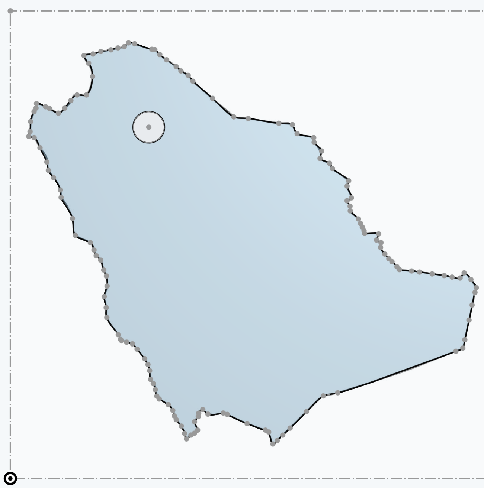
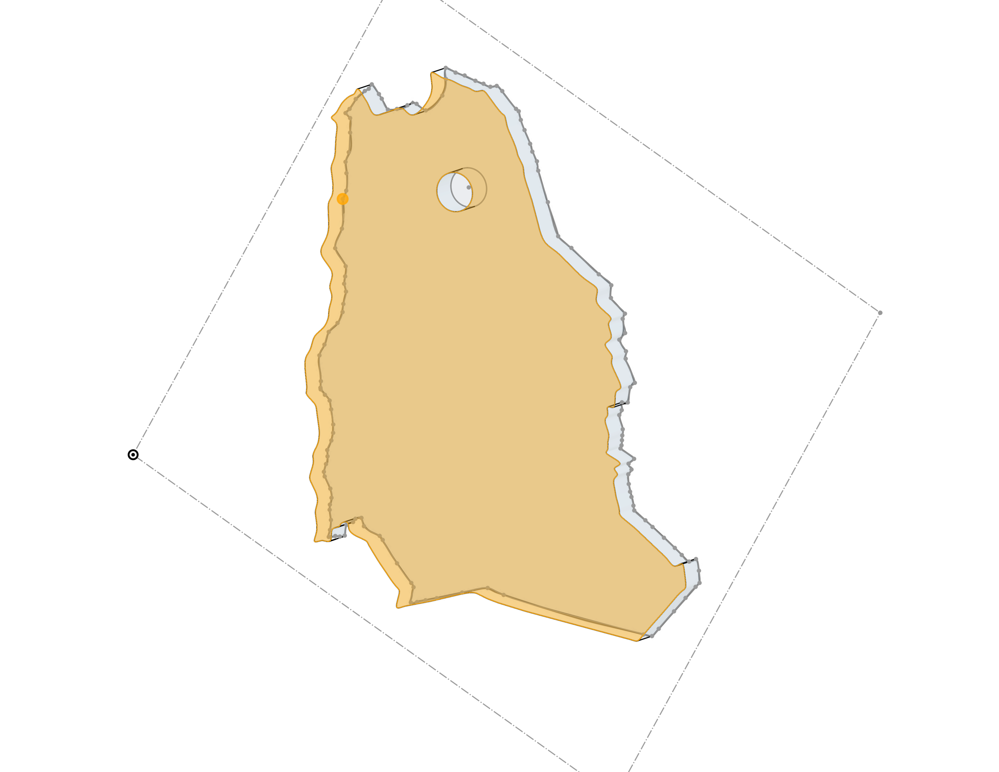

# 🌴⚔️ Our Beloved Kingdom Keychain - Onshape 3D Design 🗝️

### **A practical mechanical design project bringing our beloved Kingdom's map into a 3D-printable keychain, combining CAD precision with national pride!** 🚀

---

👉 **[Click here to open the Interactive 3D Viewer](https://cad.onshape.com/documents/73e01a0a584bcbd0d4637b74/w/4d83fd965f01f91c504754cb/e/c10b440177362ee7632ed2c8?renderMode=6&uiState=6a56c0bb4a44f465b5acdbd3)** and rotate the model with your mouse! 🇸🇦✨

---

## 🛠️ Tools & Technologies Used
To bring this project to life, the following tools and techniques were utilized:

*   **Onshape CAD:** Used to build the entire 3D model on a cloud-based platform 💻.
*   **Spline Tool (`Spline`):** Traced the geographic borders of the Kingdom with high accuracy 🗺️.
*   **Geometric Constraints:** Applied to maintain design stability and ensure a fully closed loop 📐.
*   **Extrude Tool (`Extrude`):** Gave the 2D sketch a sturdy **3mm depth** for durable 3D printing 🧱.
*   **Circular Cut-out:** Embedded a **3.5mm hole** in the northern region to fit keyrings smoothly 🔑.

---

## 📐 Design Specifications
*   **Total Width:** ~55 mm (Perfectly scaled to fit half a palm size).
*   **Thickness (Depth):** 3 mm (The gold standard for lightweight, durable keychains).
*   **Keyring Hole Diameter:** 3.5 mm (Optimized to fit standard metal keyrings).

---

## 📸 Results & Renderings
Here are the final renderings of the Saudi Arabia Map Keychain from different angles:

  
  

> 💡 **Tip:** *To view these images in your GitHub repository, make sure to upload your exported Onshape screenshots to a folder (e.g., `images/`) and replace `YOUR_IMAGE_1_PATH_OR_URL` and `YOUR_IMAGE_2_PATH_OR_URL` with the actual file paths!*
